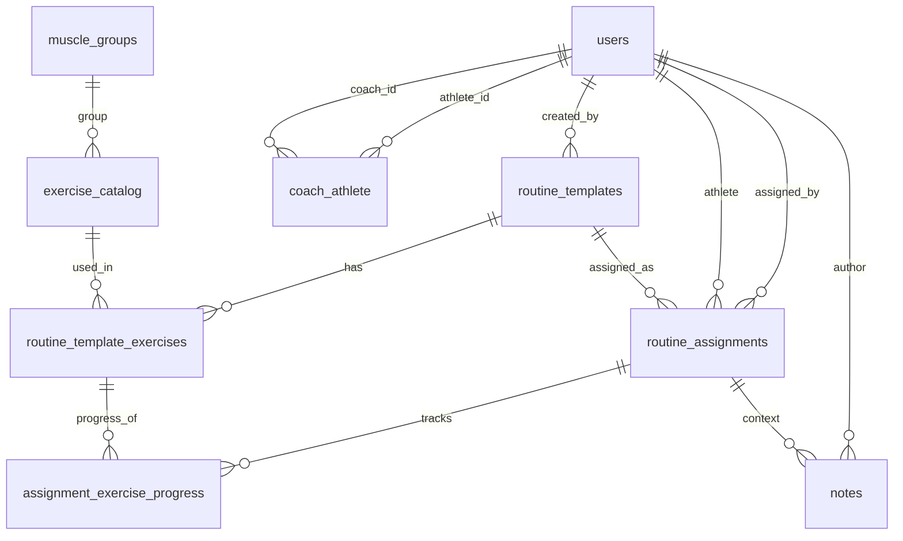

# Modelo de base de datos (Rutina360)

Este modelo está diseñado para:
- que un profesor físico cree rutinas (plantillas),
- que pueda asignarlas a uno o varios alumnos,
- que cada alumno registre su progreso sin modificar la plantilla original,
- y habilitar dashboard de gestión.

## Entidades principales

1. `users`: usuarios del sistema (`admin`, `coach`, `athlete`).
2. `coach_athlete`: relación profesor-alumno (N:N).
3. `muscle_groups`: catálogo de grupos musculares.
4. `exercise_catalog`: catálogo global de ejercicios (como tu `helpers/ejercicios.js`).
5. `routine_templates`: rutina base creada por profesor o usuario.
6. `routine_template_exercises`: ejercicios dentro de una rutina con orden y parámetros.
7. `routine_assignments`: asignación de rutina a alumno.
8. `assignment_exercise_progress`: progreso por ejercicio para cada asignación.
9. `notes`: notas por usuario o por asignación.

## Diagrama rápido (ER simplificado)

## SQL (PostgreSQL)

El script completo está en [modelo_db.sql](./modelo_db.sql).

## Mapeo con tu app actual

- `rutina.id` -> `routine_templates.id`
- `rutina.nombre` -> `routine_templates.name`
- `rutina.tiempo` -> `routine_templates.estimated_total_seconds`
- `rutina.ejercicios[]` -> `routine_template_exercises[]`
- `ejercicio.seriesRealizadas` (hoy en plantilla) -> mover a `assignment_exercise_progress.completed_sets`
- `usuario` (Redux) -> `users` + campos de perfil

## Recomendación de implementación por etapas

1. Crear tablas catálogo + usuarios + rutinas template.
2. Migrar creación/edición de rutinas para que guarden en `routine_templates`.
3. Agregar asignaciones (`routine_assignments`) para flujo profesor -> alumno.
4. Conectar pantalla de ejecución para guardar progreso en `assignment_exercise_progress`.
5. (Opcional) Agregar historial detallado por sesión.
